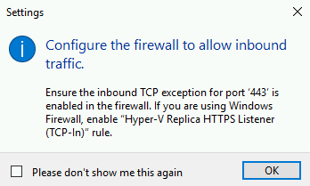
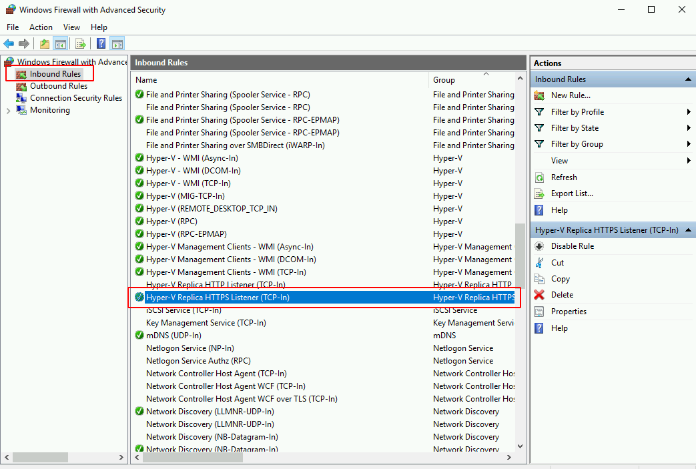

failover.rst

En el nodo01.dominio.local se debe ejecutar el comando te Trusted Host.
	winrm set winrm/config/client '@{TrustedHosts="nodo02.dominio.local"}'

En el nodo02.dominio.local se debe ejecutar el comando te Trusted Host.
	winrm set winrm/config/client '@{TrustedHosts="nodo01.dominio.local"}'

Habilitamos la replicación en el nodo01.dominio.local

Habilitamos en le Firewall el puerto para la replicación, los hacemos de en el nodo01.dominio.local

En el nodo01.dominio.local se debe ejecutar el comando te Trusted Host.::

	winrm set winrm/config/client '@{TrustedHosts="nodo02.dominio.local"}'

En el nodo02.dominio.local se debe ejecutar el comando te Trusted Host.::

	winrm set winrm/config/client '@{TrustedHosts="nodo01.dominio.local"}'

Si no ejecutamos los comando anteriores tendremos el siguiente problema cuando desde la Consola de Hyper-V queramos ingresar a otros servidores.

Ahora vamos a planificar un Failover

Debemos hacer Turn Off de la Maquina Virtual y lo intentamos nuevamente 

Vemos como cambio ahora el Primario y el Replicador

Nos vamos al nodo02.dominio.local y vemos el estado de la maquina virtual.

Ahora para regresarlo al nodo01.dominio.local hacemos los mismos pasos de Planned Failover. Apagamos la maquina virtual

Nos vamos al nodo01.dominio.local y vemos que el estatus de la maquina virtual

Listo...!!!
