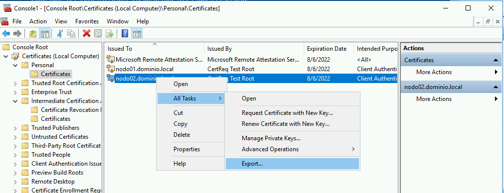
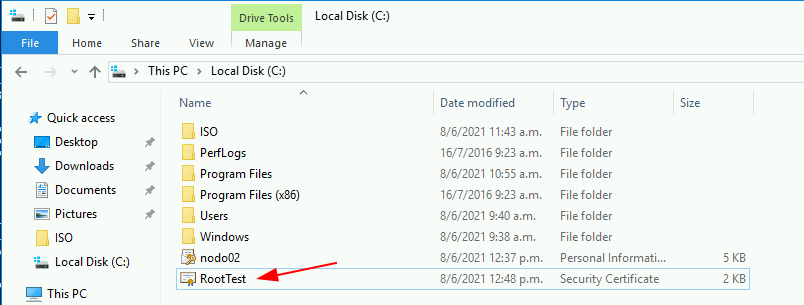
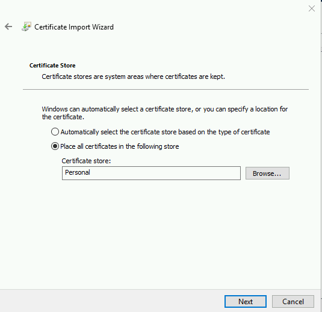
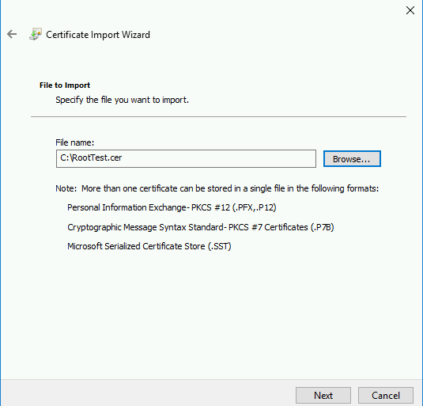

Configurar el Hyper-V para replicación
======================

Utilizaremos la siguiente premisa para la configuración de la replicación.

	nodo01.dominio.local - 192.168.1.20 - Primario donde estarán las VM

	nodo02.dominio.local - 192.168.1.21 - Secundario el cual recibirá la replica de las VM

Vamos a empezar en el **nodo02** abrimos el Hyper-V y lo vamos a configurar para que sea la Replica.

Como se vera, hay dos tipos de autenticación en Hyper-V: por Kerberos y por certificados HTTPS. Teniendo en cuenta que Kerberos está disponible solo en entornos de dominio, Como este laboratorio no esta en un dominio vamos por la opción de certificados.

Nos genera el siguiente error porque no tenemos certificado.

Vamos a proceder a crear los certificados y colocarlos en donde correspondan.

En el **nodo01** vamos a ejecutar en powershell los siguiente comandos::

	New-SelfSignedCertificate -DnsName “nodo01.dominio.local” -CertStoreLocation “cert:\LocalMachine\My” -TestRoot

	New-SelfSignedCertificate -DnsName “nodo02.dominio.local” -CertStoreLocation “cert:\LocalMachine\My” -TestRoot

Verificamos en el **mmc** los certificados creados.

Verificamos en el **mmc** el certificados Trusted Root Test.

En el **mmc** vamos a leer los dos (2) certificados y el certificaro Root Test que los firmo.

Se han configurado los certificados para el servidor principal, nodo01.dominio.local. El siguiente paso es exportar el certificado del servidor nodo02.dominio.local junto con el certificado Root Test CertReq e importarlos a servidor nodo02.dominio.local

Exportamos el certificado Root Test CertReq

Ahora los copiamos al nodo02.dominio.local

Nos genera el siguiente error

En ambos servidores debemos habilitar el **Advanced Sharing Setting** del network

Volvemos a probar

Ya tenemos los certificados copiados en el nodo02.dominio.local ahora los vamos a importar con la ayuda del mmc

.. figure:: ../images/config/33.png

.. figure:: ../images/config/35.png

Ahora importamos el Root Test 

