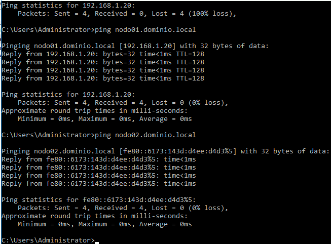

Instalar Hyper-V
================

Este laboratorio se realizo sobre el SO Microsoft Windows Server 2016 Datacenter. Tendremos dos (2) servidores

nodo01.dominio.local - 192.168.1.20
nodo02.dominio.local - 192.168.1.21

Las siguientes configuraciones se deben realizar en ambos Servidores.

**Habilitar Remote Desktop y permitir en el Firewall la conexión**

.. figure:: ../images/install/01.png

**Configuramos los nombres de los Servidores y el Workgroup**

Colocar Primary DNS Sufix

Reiniciamos el Servidor

Configurar el archivo hosts en ambos servidores.

.. figure:: ../images/install/06.png

**Habilitar el firewall el ICMP y hacer las pruebas de ping entre los servidores**

Hacer el ping desde los dos servidores 

Las siguientes configuraciones se deben realizar en ambos Servidores.

Hyper-V no se instala de forma predeterminada en los sistemas Windows, se debe instalarlo antes de poder usarlo. El equipo debe tener activo la compatibilidad de BIOS de Virtualización. 

.. figure:: ../images/install/18.png

Se debe reiniciar le servidor

Listo ya tenemos instalado el Hyper-V

